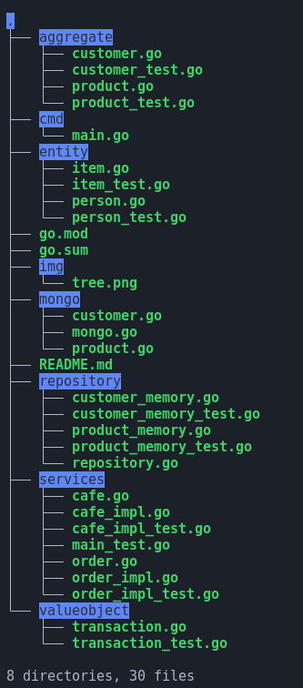

# goddd

A repo for practicing DDD pattern on golang

## What DDD

DDD stand for domain driven design, it's a pattern for designing software. It's a way to design software that is flexible and easy to maintain.

## Why DDD

In big projects or projects that have a lot of features, it's hard to maintain the code. It's hard to add new features or fix bugs. And this is wehere DDD comes in place to make the software flexible and easy to maintain.

## Cafe DDD

Cafe DDD is a project that I'm working on to practice DDD pattern on golang. It's a simple cafe management system.

This project has the following features:

- Add new product
- Add new customer
- Create order

These of course are basic features, but they are enough to practice DDD pattern.

The DDD pattern is implemented to make the swap between packages easy. For example, if I want to change the database from mysql to postgres, I can do it easily by changing the implementation of the repository interface.

But in my case it's between memory repository & mongo repository.

## Packages structure



| Package | Description |
| ------- | ----------- |
| aggregate | Contains all project complex structures |
| entity | Contains all the basic (building blocks) structs |
| repository | Contains all the interfaces for the repositories(Customer, Product)|
| memory | Contains the implementation of the repositories in memory |
| service | Contains all the business logic |
| cmd | Contains the main file to run the application|

## Run test

```bash
go test ./... -v -cover
```

## Run application

```bash
go run cmd/main.go
```